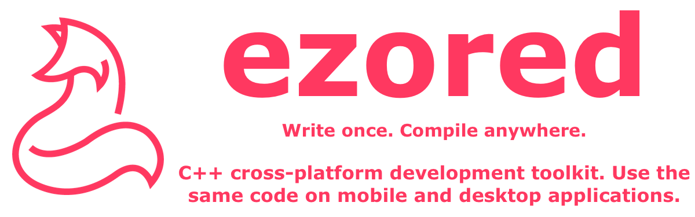

# ezored sdl2

## About

Sample project using **ezored** to build a SDL2 application.

## Supported platforms:

1. macos
2. linux
3. windows

Obs: Generally any platform with C++ support will work too, like smart tvs and embeded hardwares.

## Requirements:

1. Check [ezored](https://github.com/ezored/ezored) project for general requirements.
2. Add bincrafters conan server:  
    > conan remote add bincrafters https://api.bintray.com/conan/bincrafters/public-conan

##### Raspberry Pi:
1. sudo apt-get install libudev-dev  
2. sudo apt-get install libusb-dev  
3. sudo apt-get install libusb-1.0-0-dev  

## How to use:

1. Clone reposity:  
    > git clone git@github.com:ezored/ezored-sdl2.git

2. Enter on cloned folder:  
    > cd ezored-sdl2

3. The other commands is the same of any **ezored** project:  
    https://github.com/ezored/ezored    

## Dist folder prebuilt

The folder containing all prebuilt things (windows, macos, linux and others) are not versioned, but you can download a full version with the following command:

> python make.py dist download

This command will download the following file:

> http://public.ezored.com/ezored/prebuilt/dist-sdl2.zip

And will unpack for you creating a folder called **"dist"** with all prebuilt files in the project root folder.

You can also pack **"dist"** folder again using:

> python make.py dist pack

## Supported By Jetbrains IntelliJ IDEA

## License

[MIT](http://opensource.org/licenses/MIT)

Copyright (c) 2019-present, Paulo Coutinho
